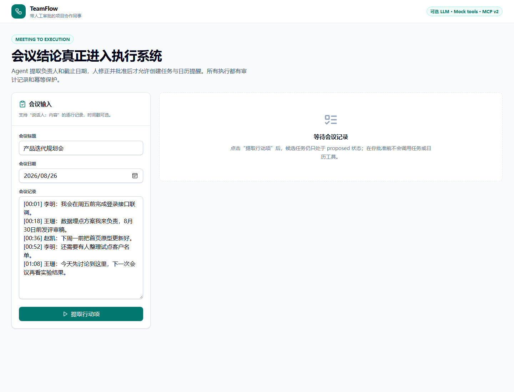

# TeamFlow：会议到执行 Agent

TeamFlow 把会议记录转成可执行行动项，但不会越过人做决定。Agent 只负责提取任务、负责人、截止日期和来源原句；缺字段的任务必须由人补充，人工批准后，工具层才会创建模拟任务和日历提醒。

工具调用具有幂等键，同一个会议、行动项和工具重复执行时会返回既有对象，不会重复创建。所有提取、审批和执行事件写入 SQLite 审计日志。默认使用规则基线；配置阿里云百炼千问的 OpenAI-compatible 端点后可由模型结构化抽取，但来源原句必须逐字命中会议记录。



## 能证明什么

- 用 LangGraph 实现会议分段、行动项提取和字段验证。
- 支持结构化 LLM 抽取、source quote 防幻觉校验与失败回退。
- 实现 Human-in-the-loop（人在回路）状态机：`proposed → approved → executed`。
- 工具层同时提供本地服务接口和 MCP（Model Context Protocol）传输入口。
- 对副作用使用幂等键并提供可验证的重复拦截指标。
- 前端支持勾选、修正、审批、执行、安全重试和审计回看。
- pytest 覆盖审批绕过、缺字段、幂等重试和 HTTP 全流程。

## 架构

```text
会议记录
   │
   ▼
LangGraph：segment → extract → validate
   │ proposed actions（无副作用）
   ▼
React 人工审批台 ──► FastAPI / SQLite 状态机
                         │ 仅 approved
                         ▼
                  Mock task/calendar tools
                         │
                         ├── idempotency key
                         └── audit log

MCP server ──► 与 HTTP 工具共享 payload builders
```

详细设计见 [`docs/architecture.md`](docs/architecture.md)。

## 本地启动

后端（PowerShell）：

```powershell
cd E:\简历\Project1-2-3\03-teamflow
uv venv .venv --python 3.12
uv pip install --python .venv\Scripts\python.exe -e ".[dev]"
.venv\Scripts\python.exe -m uvicorn app.main:app --app-dir backend --port 8003
```

前端（另开一个 PowerShell）：

```powershell
cd E:\简历\Project1-2-3\03-teamflow\frontend
pnpm install
pnpm dev
```

访问 `http://localhost:5175`；API 文档在 `http://localhost:8003/docs`。

如需千问辅助抽取，按 `.env.example` 设置三个 `AGENT_LLM_*` 环境变量后再启动后端；默认模型为 `qwen-plus`。不要提交真实 Key。若 Key 属于特定地域或业务空间，请以百炼控制台提供的兼容模式地址为准。

单独启动 MCP stdio 服务：

```powershell
$env:PYTHONPATH = "backend"
.venv\Scripts\python.exe -m app.mcp_server
```

容器启动：

```powershell
docker compose up --build
```

## 测试与评测

```powershell
.venv\Scripts\python.exe -m pytest
.venv\Scripts\python.exe -m ruff check backend tests evals
.venv\Scripts\python.exe evals\run_eval.py
pnpm --dir frontend build
```

评测脚本比较行动项召回、负责人和截止日期的精确匹配，并检查 `approval_bypass_count`。幂等行为由独立测试通过“首次执行/再次执行”的外部 ID 对比验证。

## 关键状态约束

| 当前状态 | 允许动作 | 禁止动作 |
| --- | --- | --- |
| `proposed` | 编辑、选择、人工批准 | 创建外部任务 |
| `approved` | 执行工具 | 跳过审计 |
| `executed` | 幂等重试、回看 | 创建重复对象 |

审批时负责人和截止日期都不能为空。工具只连接模拟系统，不会向真实第三方服务发送消息或创建事项。

## 目录

```text
backend/app/workflow.py      提取与验证工作流
backend/app/repository.py    状态、审计和幂等存储
backend/app/tools.py         模拟副作用工具
backend/app/mcp_server.py    MCP stdio 入口
data/sprint-planning.txt     演示会议记录
frontend/                    审批与执行工作台
tests/                       状态机和接口测试
evals/                       字段级评测
```

## 已知限制

- 离线基线只支持项目文档中的中文日期表达；模型模式也必须返回 ISO 日期并通过结构校验。
- 任务与日历工具是本地模拟实现；接入真实系统前必须补 OAuth、权限范围和撤销流程。
- 会议记录为人工构造，未处理真实音频转写、说话人识别或个人信息。
